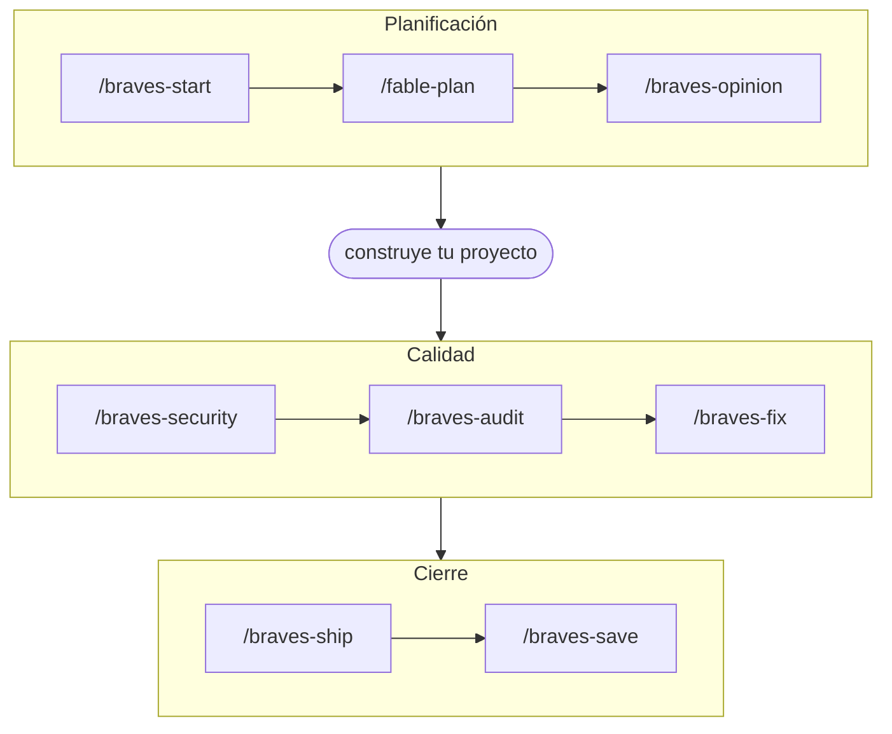

<p align="center">
  <picture>
    <source media="(prefers-color-scheme: dark)" srcset="media/Braves_Skills_white.svg">
    
  </picture>
</p>

**Español** | [English](README.en.md) 

# braves-skills

La caja de herramientas todo-en-uno que uso en mi trabajo con Claude Code, posee 17 skills
que cubren el ciclo de vida completo de un proyecto (11 skills de ciclo de
vida + 6 skills de soporte), porque me volvia loco recordar 40 skills
sueltas y sin saber si chocaban o no, braves skills resuelve esto.

## Mi ciclo de trabajo con Claude Code
Puedes ejecutarlo así:



| Skill | Qué hace |
|-------|----------|
| `/braves-setup` | Te permite configurar el entorno de trabajo para que Claude pueda trabajar contigo. Configura: identidad git, firma de commits (coautoría de IA OFF por defecto), política de PR/merge, NotebookLM opcional, adopción de tus propias skills. |
| `/braves-help` | Muestra esta caja de herramientas y qué skill usar para cada tarea. |
| `/braves-start` | Arranque de proyecto: PRD, TRD, UI/UX, Flow, Backend y Plan antes de tocar código. |
| `/fable-plan` | Las preguntas que un arquitecto senior hace antes de construir → un plan por fases con verificación. |
| `/braves-opinion` | Abogado del diablo: crítica constructiva sin adulación. Veredicto SHIP / SHIP WITH CHANGES / RETHINK / KILL. |
| `/braves-security` | El candado: auditoría de infraestructura (secretos, proxy de API, RLS, pooling, cache, rate limits, pruebas de carga con k6/Artillery) + código (OWASP). |
| `/braves-audit` | Auditoría global (seguridad + sobre-ingeniería + rendimiento). Escribe un `braves-audit-DATE.md` ejecutable en la raíz del repo. |
| `/braves-fix` | Arregla bugs con evidencia obligatoria; ejecuta el runbook `braves-audit-DATE.md` si existe uno. |
| `/braves-ship` | Cierre profesional: chequeos previos, commit con tu firma, PR/merge según tu configuración, checklist de release. |
| `/braves-save` | Cierre de sesión: memorias + entrada de log al notebook AI Brain (NotebookLM). |
| `/braves-notebook` | API completa de Google NotebookLM (fuentes, podcasts, reportes, quizzes, descargas). |

### Skills de soporte (adoptadas)

| Skill | Qué hace |
|-------|----------|
| `/desarrollo` | Planifica una feature y constrúyela mediante agentes delegados. |
| `codebase-memory` | Consultas estructurales de código mediante el grafo de codebase-memory-mcp. |
| `delegate-by-default` | Modo orquestador: despacha subagentes en vez de trabajar en línea. |
| `humanizar` | Voz de marca de BravesLab para copy en español. |
| `n8n-workflow-builder` | Construye/depura workflows de n8n con validación y chequeo de CVE. |
| `wordpress-spanish` | Traducción es_ES para plugins de WordPress. |

## Instalación

Clona (o copia) dentro del directorio de skills de Claude Code:

```bash
git clone https://github.com/Carlos-Vera/braves-skills ~/.claude/skills/braves-skills
```

Se auto-carga en la siguiente sesión como `braves-skills@skills-dir` (o
ejecuta `/reload-plugins` para cargarla de inmediato). En la primera sesión,
un hook detecta que aún no hay configuración y ofrece ejecutar
`/braves-setup`.

## Configuración

`/braves-setup` es un flujo de onboarding único (re-ejecutable en cualquier
momento para cambiar valores luego). Pregunta una cosa a la vez:

1. Idioma en el que Claude debe hablarte.
2. Identidad git para los commits.
3. Si Claude hace los commits por ti (always / ask / never).
4. Firma de commit (pie de texto libre).
5. Coautoría de IA en los commits — OFF por defecto.
6. Política de PR y merge (¿crear PRs?, estrategia de merge, quién mergea, push directo a main — no por defecto) y política de releases (convención de versionado — patch por cambio, semver o la tuya propia; los releases nunca se publican sin preguntar, con recomendaciones en momentos clave).
7. Integración opcional con NotebookLM (logs de sesión enviados a un notebook "AI Brain" mediante el CLI no oficial `notebooklm-py`, login de Google asistido por navegador).
8. MCPs opcionales, con configuración guiada: Perplexity (búsqueda web con IA), Firecrawl (rastreo/scraping de sitios), Chrome DevTools (debugging frontend), Playwright (automatización y pruebas de navegador), Codebase memory (grafo de conocimiento del código), n8n (construcción de workflows).
9. Adopción de tus propias skills, MCPs y plugins en la caja: las skills se copian al plugin, los MCPs extra entran al set curado, y los plugins se registran como parte de tu kit estándar para máquinas nuevas.

La configuración vive en `~/.claude/braves-skills.json`:

```json
{
  "version": 1,
  "language": "es",
  "github_user": "your-github-user",
  "git_name": "Your Name",
  "git_email": "you@example.com",
  "commits_by_claude": "ask",
  "coauthor_ai": false,
  "commit_signature": "Author: Your Name <you@example.com>",
  "pr": {
    "create": true,
    "merge_strategy": "squash",
    "who_merges": "user",
    "direct_push_main": false
  },
  "notebooklm": { "enabled": false },
  "releases": { "versioning": "semver", "always_ask": true, "recommend_at_key_moments": true },
  "mcps": [],
  "plugins": [],
  "adopted_skills": []
}
```

Todas las skills te hablan en el `language` configurado (fallback: español
por defecto si `language` no está definido).

## Contribuir

Consulta [CONTRIBUTING.md](CONTRIBUTING.md) para saber cómo agregar o cambiar
skills.

## Créditos

- Las skills de auditoría heredan la filosofía y el formato de
  [ponytail](https://github.com/DietrichGebert/ponytail) (MIT, Dietrich
  Gebert), del cual este proyecto es un fork conceptual.
- `braves-save` y `braves-notebook` son ports de
  [BrainClaude](https://github.com/Carlos-Vera/BrainClaude) (Carlos Vera).

## Licencia

MIT — ver [LICENSE](LICENSE).
