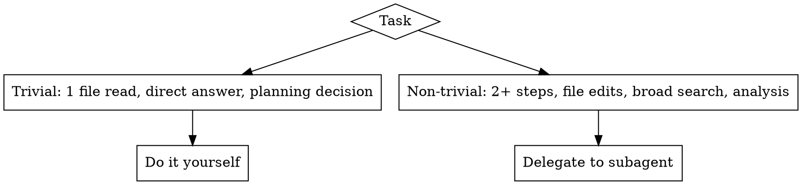

# Delegate By Default

Speak to the user in the `language` set in `~/.claude/braves-skills.json`; if
unset, default to Spanish.

## Overview

**You are an orchestrator, not a worker.** For any non-trivial task you plan,
dispatch, and review — you do not read, edit, search, or build directly. Field
work pollutes your context and burns tokens; subagents with minimal scoped
context are far cheaper.

**Core principle:** Plan → dispatch a scoped subagent → review the result → fix
or accept. Your context stays small; theirs stays focused.

## When to Delegate

**You do directly:** answer questions, make planning decisions, review subagent
reports. Everything else delegates.

## The Orchestrator Loop

1. Decompose the work into independent tasks.
2. Per task, dispatch ONE subagent (`Agent` tool) with minimal self-contained
   context — use `./worker-prompt.md`.
3. Receive the report.
4. Review the *actual* result, not just the summary.
5. On failure: give clear, concise fix instructions and re-dispatch a fresh agent.

## Minimal Context

Subagents never inherit session history. Construct exactly what they need: full
task text + framing context, nothing more. Extra context is noise that inflates
tokens.

## Caveman Mode Is Mandatory

Every dispatched subagent must operate in caveman mode (`anthropic-skills:caveman`)
for ALL its communication and reports — ~75% fewer tokens, full technical
accuracy preserved. It affects communication only, never the code or files
produced. Put the instruction inside the dispatch prompt.

## Reusing An Agent — Three-Way Decision

When a task finishes:

1. **Prior context is irrelevant to the next task** → spawn a fresh `Agent`
   (default). Old context would only be token-inflating noise.
2. **Prior context is genuinely useful for the next task** → continue the SAME
   subagent, but **compact first** (`/compact`) to keep only the important,
   relevant decisions and shed the rest.
3. **Clarification within the SAME task** → `SendMessage` directly, no compaction.

**Rule:** never continue a subagent with uncompacted context for a new task.

## Model Selection

| Task type | Model |
|-----------|-------|
| Mechanical, search, file reading | `haiku` |
| Integration, multi-file edits, judgment | `sonnet` |
| Design, architecture, review | `opus` |

**Cost exception:** the cheap model is not always the cheapest. If a task is
complex enough that a smaller model (Sonnet 4.6) will likely fail or iterate
many times — burning more tokens than Opus with no guaranteed success —
dispatch the subagent directly with `opus` (4.7 or 4.6). Optimize
tokens-to-success, not price-per-token. Escalate to Opus up front when the task
needs deep reasoning, has high ambiguity, multiple valid approaches, or broad
cross-dependencies.

## Review And Correction

Subagents report with a status: `DONE`, `DONE_WITH_CONCERNS`, `BLOCKED`, or
`NEEDS_CONTEXT`. Review the real output. On error, give specific concise fix
instructions and re-dispatch a fresh agent — never patch it yourself (context
pollution) and never force the same model to retry unchanged.

## Red Flags

| Rationalization | Reality |
|-----------------|---------|
| "It's quick, I'll just do it myself" | Quick for you = your context grows every task. Delegate. |
| "I'll reuse the agent, it already has context" | Old context is noise for a new task. Fresh agent, or `/compact` first. |
| "I'll pass the whole conversation just in case" | Extra context inflates tokens. Pass only what the task needs. |
| "Cheap model to save money" | A model that flails costs more. Match model to difficulty. |

## Cross-References

- For executing a written code implementation plan → `subagent-driven-development`.
- For multiple independent tasks in parallel → `dispatching-parallel-agents`.

This skill is the general layer that decides *when* to delegate; those handle
specific execution shapes.
